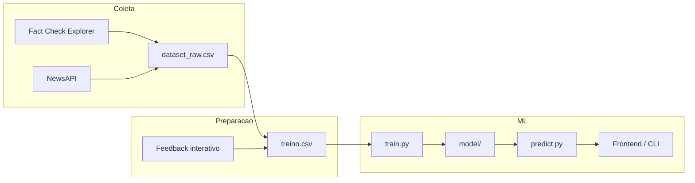
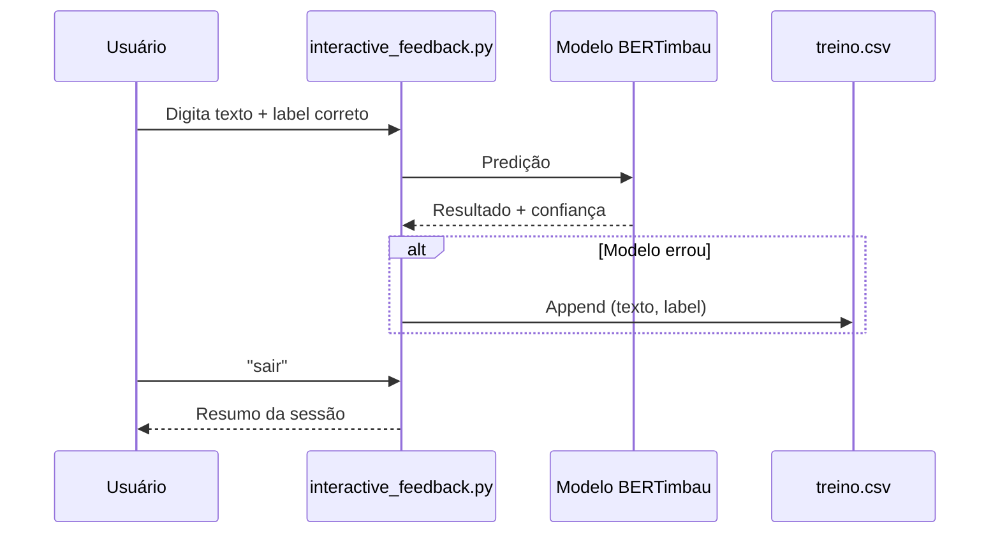

# Documentação Técnica — Aletheia IA Backend

Este documento descreve o funcionamento completo do backend do **Aletheia IA**, um classificador de fake news eleitorais em português, e como o projeto foi construído ao longo do desenvolvimento.

O frontend complementar está em [aletheia_ia_frontend](https://github.com/Aletheia-ia/aletheia_ia_frontend).

---

## 1. Visão geral

O Aletheia IA é um sistema de **aprendizado supervisionado** que recebe uma afirmação textual (título de notícia, claim de fact-checking ou frase curta) e classifica como:

| Label numérico | Label textual | Significado |
|----------------|---------------|-------------|
| `0` | FALSO | Desinformação / fake news |
| `1` | VERDADEIRO | Informação considerada verdadeira |

O núcleo do sistema é o **BERTimbau** (`neuralmind/bert-base-portuguese-cased`), um modelo Transformer pré-treinado em português brasileiro, adaptado via *fine-tuning* para classificação binária de sequências.

### Por que BERTimbau?

Diferente de abordagens baseadas em bag-of-words ou TF-IDF, o BERTimbau analisa o **contexto completo** da frase. Isso é relevante para desinformação eleitoral, que frequentemente imita a linguagem jornalística e depende de nuances semânticas para ser detectada.

---

## 2. Estrutura do repositório

```
aletheia_ia_backend/
├── README.md                 # Guia de uso e instruções rápidas
├── DOCUMENTACAO.md           # Este arquivo
├── .gitignore
│
├── dataset/                  # Pipeline de coleta de dados brutos
│   ├── gerar_dataset.py      # Script de coleta e balanceamento
│   └── dataset_raw.csv       # Dataset bruto gerado (1016+ registros)
│
└── projeto_ml/               # Pipeline de ML (treino, inferência, feedback)
    ├── dataset/
    │   ├── treino.csv        # Dataset formatado para treino (texto, label)
    │   └── treino1.csv       # Variante/backup do dataset
    ├── model/                # Modelo e tokenizer finais (gerado após treino)
    ├── outputs/              # Checkpoints intermediários (best_model.pt)
    ├── train.py              # Treinamento com early stopping
    ├── predict.py            # Inferência unitária ou interativa
    ├── interactive_feedback.py  # Loop de feedback humano
    ├── test_batch.py           # Avaliação em lote
    ├── requirements.txt
    └── README.md
```

Artefatos grandes (modelo treinado, checkpoints `.pt`) ficam no `.gitignore` e precisam ser gerados localmente após o treinamento.

---

## 3. Arquitetura do sistema

O projeto segue um pipeline em três etapas independentes, mas encadeáveis:



### Fluxo de dados

1. **Coleta** (`dataset/gerar_dataset.py`) — busca exemplos reais de fake news e notícias verdadeiras.
2. **Preparação** — o CSV bruto é convertido para o formato `texto,label` com labels numéricos (`0`/`1`).
3. **Treinamento** (`projeto_ml/train.py`) — fine-tuning do BERTimbau.
4. **Inferência** (`projeto_ml/predict.py`) — classificação de novos textos.
5. **Feedback** (`projeto_ml/interactive_feedback.py`) — correção humana que enriquece o dataset e permite re-treino.

---

## 4. Como o projeto foi construído

Com base no histórico de commits do repositório, o desenvolvimento seguiu esta ordem:

| Commit | Descrição |
|--------|-----------|
| `9e9bfa2` | Commit inicial do repositório |
| `bbc49bd` | Script de coleta de dataset (`gerar_dataset.py`) |
| `4384d7f` / `7f5615a` | Datasets balanceados (1264 → 1018 registros finais) |
| `0311294` | Pipeline de treinamento e inferência |
| `bee3bd4` | Modelo pré-treinado incluído (posteriormente removido do git por `.gitignore`) |
| `8d569ac` | Script de feedback interativo e atualização da documentação |

O projeto foi desenvolvido por um grupo acadêmico para as disciplinas de **Machine Learning** e **Inteligência Artificial**, com foco em desinformação eleitoral brasileira.

---

## 5. Etapa 1 — Coleta e preparação do dataset

**Arquivo:** `dataset/gerar_dataset.py`

### 5.1 Fontes de dados

| Fonte | Biblioteca/API | Classe gerada | Descrição |
|-------|----------------|---------------|-----------|
| Google Fact Check Explorer | [GONZOsint/factcheckexplorer](https://github.com/GONZOsint/factcheckexplorer) | `Fake` | Claims verificados por agências como Agência Lupa, Aos Fatos, G1 Fato ou Fake |
| NewsAPI | [newsapi.org](https://newsapi.org) | `True` | Notícias de portais jornalísticos confiáveis em português |

### 5.2 Palavras-chave de busca

As buscas usam 29 keywords de tema eleitoral e político, como `eleição`, `Bolsonaro`, `lula`, `STF`, `fraude`, `corrupção`, `Datafolha`, entre outras.

### 5.3 Pipeline de coleta (`coletar_fake`)

Para cada keyword:

1. Consulta o Fact Check Explorer (até 400 resultados por keyword).
2. Remove duplicatas pela coluna `Claim`.
3. Filtra apenas textos em **português** (`langdetect`).
4. Padroniza o veredito da agência em `Fake` ou `True` com base em termos como `falso`, `enganoso`, `misleading` (fake) ou `verdadeiro`, `confirmado` (true). Vereditos ambíguos são descartados.
5. Mantém apenas registros com **conteúdo político relevante** (≥ 2 palavras de uma lista de 50+ termos políticos).
6. Associa a keyword encontrada no texto.

### 5.4 Pipeline de coleta (`coletar_true`)

Para cada keyword:

1. Consulta a NewsAPI (`/v2/everything`) em até 3 páginas (100 artigos/página).
2. Usa título + descrição do artigo como texto.
3. Descarta títulos com menos de 20 caracteres.
4. Aplica o mesmo filtro de relevância política.
5. Remove duplicatas por texto.

### 5.5 Balanceamento (`equilibrar_e_salvar`)

Para evitar viés por keyword ou desbalanceamento de classes:

1. Agrupa registros Fake e True por `palavra_chave`.
2. Para cada keyword, mantém `min(qtd_fake, qtd_true)` exemplos de cada classe.
3. Keywords sem cobertura em ambas as classes são removidas.
4. Embaralha o dataset final (`random_state=42`).
5. Salva em `dataset/dataset_raw.csv`.

**Resultado esperado:** ~1016 registros, 50% Fake / 50% True.

### 5.6 Esquema do dataset bruto

| Coluna | Descrição |
|--------|-----------|
| `texto` | Afirmação ou título coletado |
| `label` | `Fake` ou `True` (string) |
| `verdict_original` | Veredito original da agência |
| `fonte` | Nome da agência ou portal |
| `url_original` | Link da checagem ou notícia |
| `data_checagem` | Data de publicação |
| `tags` | Tags temáticas |
| `palavra_chave` | Keyword que originou o registro |

O dataset de treino (`projeto_ml/dataset/treino.csv`) usa apenas `texto,label` com labels numéricos (`0` = falso, `1` = verdadeiro).

---

## 6. Etapa 2 — Treinamento do modelo

**Arquivo:** `projeto_ml/train.py`

### 6.1 Pré-processamento

A função `clean_text()` aplica as mesmas transformações em treino e inferência:

- Remove URLs (`http://`, `www.`)
- Remove emojis
- Normaliza espaços em branco

### 6.2 Divisão dos dados

Split estratificado com `sklearn.model_selection.train_test_split`:

| Conjunto | Proporção |
|----------|-----------|
| Treino | 70% |
| Validação | 15% |
| Teste | 15% |

A estratificação garante a mesma proporção de classes em cada split.

### 6.3 Tokenização

- Tokenizer: `AutoTokenizer` do Hugging Face (BERTimbau).
- `max_length=128` tokens (padrão).
- Padding fixo (`max_length`) e truncamento ativado.

### 6.4 Modelo

```python
AutoModelForSequenceClassification.from_pretrained(
    "neuralmind/bert-base-portuguese-cased",
    num_labels=2,
    hidden_dropout_prob=0.3,
    attention_probs_dropout_prob=0.3,
)
```

Mapeamento de labels:

- `0` → FALSO
- `1` → VERDADEIRO

### 6.5 Hiperparâmetros padrão

| Parâmetro | Valor | Função |
|-----------|-------|--------|
| `--epochs` | 3 | Rodadas de treino |
| `--batch_size` | 8 | Tamanho do batch |
| `--learning_rate` | 2e-5 | Taxa de aprendizado |
| `--weight_decay` | 0.01 | Regularização L2 |
| `--max_length` | 128 | Limite de tokens |
| `--patience` | 2 | Early stopping |
| `--dropout` | 0.3 | Dropout no BERT |
| `--seed` | 42 | Reprodutibilidade |

### 6.6 Treinamento

- **Otimizador:** AdamW com weight decay.
- **Scheduler:** linear warmup (sem warmup steps extras).
- **Loss:** cross-entropy com **pesos de classe** (ativado por padrão) para lidar com possível desbalanceamento.
- **Gradient clipping:** norma máxima de 1.0.
- **Early stopping:** interrompe se a loss de validação não melhorar por `patience` épocas consecutivas.

### 6.7 Saídas do treinamento

| Arquivo | Conteúdo |
|---------|----------|
| `outputs/best_model.pt` | State dict do melhor checkpoint (menor val loss) |
| `model/` | Modelo + tokenizer prontos para inferência (formato Hugging Face) |

### 6.8 Métricas de avaliação

Ao final, o script calcula sobre o conjunto de **teste**:

- Accuracy
- Precision, Recall, F1-score (média binária)
- Matriz de confusão
- Relatório por classe (FALSO / VERDADEIRO)

---

## 7. Etapa 3 — Inferência

**Arquivo:** `projeto_ml/predict.py`

### 7.1 Fluxo de inferência

1. Carrega modelo e tokenizer de `model/`.
2. Limpa o texto de entrada (`clean_text`).
3. Tokeniza e envia ao modelo.
4. Aplica softmax nos logits.
5. Compara `prob_verdadeiro` com o limiar (`--threshold`, padrão 0.5).
6. Retorna label, confiança e probabilidades por classe.

### 7.2 Modos de uso

```bash
# Texto único
python predict.py --text "As urnas foram fraudadas"

# Modo interativo (modelo carregado uma vez)
python predict.py --interactive

# Ajuste de limiar
python predict.py --text "..." --threshold 0.60

# Aceleração em GPU com float16
python predict.py --text "..." --fp16
```

### 7.3 Exemplo de saída

```
Texto:
"As urnas foram fraudadas"

Resultado:
FALSO

Confianca:
93.2%

Probabilidades:
FALSO: 93.2% | VERDADEIRO: 6.8%
Limiar VERDADEIRO: 0.50
```

---

## 8. Loop de feedback humano

**Arquivo:** `projeto_ml/interactive_feedback.py`

Este script implementa um ciclo de **aprendizado ativo simplificado**:



**Comportamento:**

- Reutiliza `clean_text`, `load_model` e `run_inference` de `predict.py` (sem duplicação de código).
- Salva no dataset **somente quando o modelo erra**, evitando redundância.
- Ao final, exibe acertos, erros e detalhes dos erros.
- Indica o comando para re-treinar: `python train.py --data dataset/treino.csv`.

---

## 9. Avaliação em lote

**Arquivo:** `projeto_ml/test_batch.py`

Script auxiliar que lê `dataset/feedback_batch.csv` (se existir) e calcula acurácia, matriz de confusão e relatório por classe sobre um conjunto de exemplos rotulados manualmente.

---

## 10. Stack tecnológica

| Tecnologia | Uso |
|------------|-----|
| **Python 3** | Linguagem principal |
| **PyTorch** | Framework de deep learning |
| **Hugging Face Transformers** | BERTimbau, tokenizer, classificador |
| **Hugging Face Datasets** | Wrapping de DataFrames para tokenização |
| **scikit-learn** | Split, métricas, matriz de confusão |
| **pandas** | Manipulação de CSV |
| **numpy** | Operações numéricas |
| **tqdm** | Barras de progresso |
| **langdetect** | Detecção de idioma na coleta |
| **requests** | Chamadas à NewsAPI |
| **python-dotenv** | Variáveis de ambiente (`NEWSAPI_KEY`) |
| **factcheckexplorer** | Coleta do Google Fact Check Explorer |

### Dependências (`projeto_ml/requirements.txt`)

```
torch
transformers
datasets
pandas
numpy
scikit-learn
tqdm
```

Para a coleta de dados, instalar adicionalmente:

```bash
pip install git+https://github.com/GONZOsint/factcheckexplorer.git
pip install langdetect requests python-dotenv
```

---

## 11. Integração com o frontend

O backend expõe o modelo treinado em `projeto_ml/model/`. O frontend ([aletheia_ia_frontend](https://github.com/Aletheia-ia/aletheia_ia_frontend)) consome as predições — tipicamente via uma API que carrega o mesmo modelo e reutiliza a lógica de `predict.py` (limpeza de texto, tokenização, softmax e limiar).

O fluxo esperado em produção:

1. Usuário envia texto pelo frontend.
2. Backend executa inferência com o modelo em `model/`.
3. Retorna label, confiança e probabilidades.
4. (Opcional) Erros reportados pelo usuário alimentam o loop de feedback.

---

## 12. Reprodutibilidade e ambiente

### GPU

O código detecta CUDA automaticamente:

```python
device = torch.device("cuda" if torch.cuda.is_available() else "cpu")
```

Funciona em CPU, mas o treinamento é significativamente mais lento.

### Semente

`set_seed(42)` fixa seeds de `random`, `numpy` e `torch` (incluindo CUDA) para resultados reproduzíveis.

### Variáveis de ambiente

Para regenerar o dataset bruto, criar `dataset/.env`:

```
NEWSAPI_KEY=sua_chave_aqui
```

---

## 13. Guia rápido de execução

```bash
# 1. Instalar dependências
cd projeto_ml
pip install -r requirements.txt

# 2. Treinar (se model/ ainda não existir)
python train.py --data dataset/treino.csv

# 3. Classificar um texto
python predict.py --text "As urnas foram fraudadas"

# 4. (Opcional) Feedback interativo
python interactive_feedback.py

# 5. (Opcional) Re-treinar após feedback
python train.py --data dataset/treino.csv
```

Para regenerar o dataset do zero (requer NewsAPI key):

```bash
cd dataset
pip install git+https://github.com/GONZOsint/factcheckexplorer.git
pip install pandas langdetect requests python-dotenv
python gerar_dataset.py
```

---

## 14. Limitações conhecidas

- **Escopo temático:** treinado em desinformação eleitoral/política brasileira; generaliza mal para outros domínios.
- **Tamanho do dataset:** ~1100 exemplos — relativamente pequeno para deep learning; o feedback interativo mitiga parcialmente esse problema.
- **Fonte dos "True":** notícias da NewsAPI são tratadas como verdadeiras por presunção de fonte confiável, não por verificação individual.
- **Comprimento do texto:** truncado em 128 tokens; textos longos perdem contexto.
- **Modelo não versionado no git:** artefatos em `model/` e `outputs/` estão no `.gitignore`; é necessário treinar localmente ou obter o modelo por outro meio.

---

## 15. Integrantes

| Nome |
|------|
| Arthur de Aquino |
| Denilson Santos |
| Luan Vinicius |
| Gabriel Torres |
| Henrique Estrela |
| Matheus Kaick |
| Rafael Pinto |
| Valnei Sousa |
